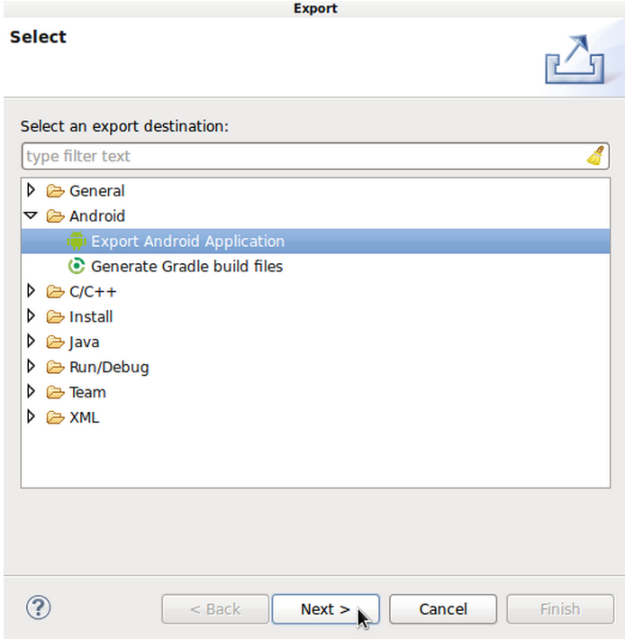
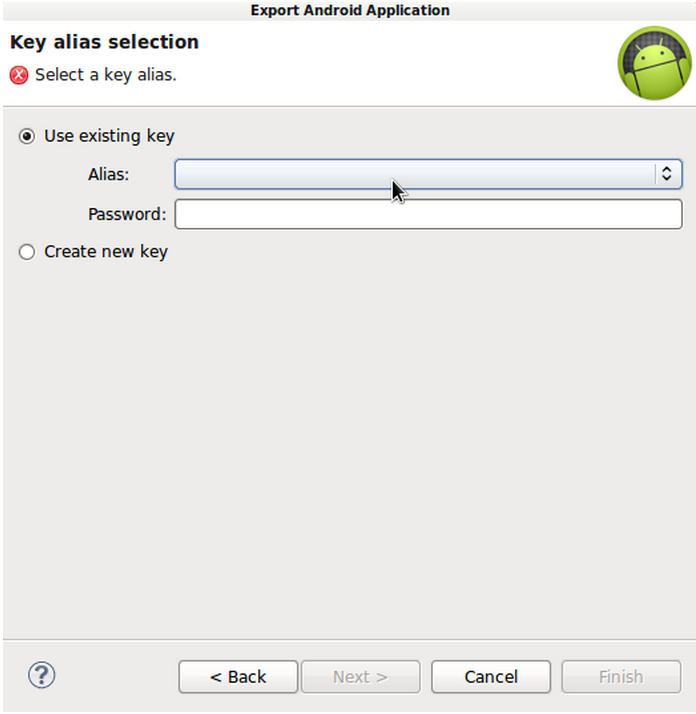

# Android SDK 上手指南：应用程序发布

> 在今天的文章中，我们将重点探讨通过 Google Play 软件商店进行应用程序发布，不过如果愿意、大家也可以深度其它一些发布途径。要通过 Google Play 商店进行应用程序发布，我们需要注意一些必要条件；不过如果通过其它途径发布则有可能无需考虑这些前提。

**介绍**
在今天的文章中，我们将重点探讨通过 Google Play 软件商店进行应用程序发布，不过如果愿意、大家也可以深度其它一些发布途径。要通过 Google Play 商店进行应用程序发布，我们需要注意一些必要条件；不过如果通过其它途径发布则有可能无需考虑这些前提。但我个人建议大家认真了解这些内容，并尽可能在任何发布方式当中都严格贯彻这些最佳实践方案。

**1.准备工作**
在我们考虑发布一款应用程序之前，首先要完成的就是全面的调试与测试工作，其中包括确保应用能够在各类不同配置的设备上正常运行。此外，大家还应该注意其它一些前提性事项。首先，如果我们的 Java 代码当中包含任何日志声明或者其它用于输出调试信息的调用内容，请务必在发布之前将其从应用内移除。

如果大家的清单文件当中包含 androi:debuggable 属性集，则需要在发布应用程序之前将其移除。我们的清单版本属性还需要经过合理配置，我将在后续内容中进一步解释该话题。大家要确保自己的应用程序资源正确包含在软件包文件夹里，例如 drawables 等指向配置信息的媒体条目。如果大家的应用程序需要使用数据库之类资源，则必须确保其经过合理调整。

如果大家的应用程序在运行中需要使用某种程度的权限，则必须在 manifest 当中利用 uses-permission 元素将其添加进来。为了顺利实现应用发布，大家还需要在 manifest 应用程序元素中设置应用图标以及标签属性。我们在清单当中列出的大部分条目都将与 Google Play 软件商店的应用列表内容相对应。

**2.版本管理**
我们在之前的文章当中已经提到过，大家需要为自己的应用程序设置一个版本号并为其命名。说起版本号，这部分信息应该被包含在根 manifest 元素中 manifest 下的 android:versionCode 与 android:versionName 属性当中。

其中 versionCode 属性应该为一个整数，且每一个应用程序新版本分配到的数字都需要比前一个更大。从逻辑角度讲，大家应该以 1 为初始版本号，并在每一次推出新版本时逐渐递增该数值；不过大家也可以随意选择自己想要的数字，只要比上一个版本数值更大即可。终端用户无法看到应用程序的版本代码值，该数值仅用于在发布过程中衡量应用程序的当前版本号是否比原先已经安装的版本更新。

不过 versionName 属性则不同，它是一个可被终端用户查看的字符串。版本名称并不需要一定与版本代码相匹配，但从逻辑上讲其同样应该遵循递进关系。举例来说，从 1.0 开始，接下来应该是 1.1，当我们发布的新内容更新幅度较大时则将其提升为 2.0。换句话来说，版本名称应该能够帮助终端用户理解应用版本的先后顺序。如果大家有计划为自己的应用程序发布多个版本，则最好花点时间来考虑怎样的版本名称最适合反映自己的升级进程。

**3.签名**
**第一步**
要在 Android 系统上安装一款应用程序，该应用必须利用具备私有密钥的证书进行签名验证。在我们的开发过程中，Eclipse 与 Android SDK 会自动利用调试密钥完成应用程序的签名过程，但大家无法通过这个调试密钥进行应用程序发布。在 Android 应用程序的创建过程中，系统会选择 debug 或者 release 两种模式之一进行创建。在 release 模式下，大家需要利用自己的私有密钥完成应用程序签名。

大家也可以利用 keytool 程序为自己的应用程序生成一个密钥，我们可以在 Java Development Kit（或者简称为 JDK）当中找到该程序。各位可以 点击此处 查看 keytool 说明文档以了解更多详细情况。在为我们的私有密钥创建了 keystore 之后，大家即可选择 alias name 以及 password，从而在日后进行应用程序签名时加以使用。

**第二步**
当我们已经准备好了应用程序签名所必需的 key/keystore 之后，正面要做的就是为其创建一个发布版本。在 Eclipse 当中，通过 Package Explorer 选中自己的应用程序项目，右键点击该项目或者选择“File”、“Export”。展开其 Android 文件夹后，选择“Export Android Application”并点击“Next”。

接下来，Eclipse 将突出显示创建过程中所遇到的全部错误信息，我们需要将其一一解决才能继续进行下一步。如果整个过程没有出现错误，大家可以直接点击“Next”以继续。在 Keystore Selection 容器中，浏览至我们的 keystore 文件并为其输入密码。接下来，从菜单中选择我们为密钥指定的 alias 并输入自己设定的密码内容。当一切准备就绪之后，点击“Next”进入下一步。

选择一个位置并为我们应用程序的 APK 文件指定一个名称。该 APK 文件也就是我们将要上传到 Google Play 商店中的文件，用户在安装过程中需要将其下载到自己的设备上并加以运行。Eclipse 会利用正确的密钥与验证机制处理应用程序签名。在点击“Finish”之后，该 APK 文件就会出现在大家所选定的保存位置。现在我们应该已经可以将该 APK 文件复制到 Android 设备上了。在复制工作完成之后，利用文件管理器应用选择该 APK 文件，并依据说明进行安装。只要应用程序签名一切正常，则系统应该能够顺利安装该应用、供大家在设备上运行所发布版本的应用程序了。

请确保我们的发布密钥受到严格保护，因为只有使用同一套密钥、大家才能在为同一软件包发布更新内容。如果大家利用其它不同的验证机制处理应用程序的更新版本，则必须使用与原先不同的软件包名称。

提示:在发布特定应用程序时，大家可能需要执行额外一些步骤。举例来说，需要利用谷歌地图库的应用程序要求我们为 Maps API 设定一个专门的发布密钥。

**4.发布**
在我们创建好了一个完整版 APK 文件之后，接下来要做的就是将应用程序发布到 Google Play 软件商店当中。除了应用程序本身，我们还需要为发布过程准备一些额外资源——其中一部分最好能提前准备就绪。首先，应用程序的销售宣传图片以及功能描述是必不可少的，大家需要将这部分信息添加到应用程序的列表当中。我们还需要为应用程序在软件商店中的介绍与下载界面设计说明内容，其中包括应用程序的定价（如果这是一款收费应用的话）、应用程序的内购项目以及语言设定等等。

要着手进行发布流程，我们首先需要登录自己的谷歌账户并导航至 Developer Console。点击“Add New Application”并在弹出的窗口中选择自己应用程序的默认语言、输入应用程序名称。从这里开始，大家就要用到之前准备好的应用程序清单并上传我们刚刚创建好的 APK 文件。

相信大家已经注意到了，我们应用程序的 Google Play 清单会要求填写大量细节信息，而且整个发布过程也需要一定时间。在每款应用的主清单部分，大家可以添加一部分图形内容——例如应用图标、应用截图、视频介绍、应用程序描述、功能类别、内容评级以及开发者的联系方式等。如果各位对这些信息在 Google Play 中的显示效果还没啥概念，请直接参照商店中其它已经摆上货架的其它应用程序。

在应用程序清单中的 Pricing and Distribution 部分，大家需要指定自己的应用是否需要收费或者可以免费提供给用户。请注意，免费应用程序无法被重新修改为收费应用。不过大家可以修改收费应用的价格或者将收费应用修改为免费。我们也可以在免费应用当中设置内购机制。如果大家的应用程序适用于多个国家，Google Play 会自动将我们设定的价格换算为其它货币单位。请大家花点时间仔细查看应用程序清单当中的其它内容，例如应用内产品以及 API 等。

如果大家已经在 Google Play 上发布一个或者多个应用程序，则可以在 Developer Console 当中查看各应用的当前状态。这套控制台为开发人员提供了非常详尽的报告内容。我们可以对清单的统计部分进行配置，从而更准确地把握其 Android 版本、应用版本、国家、设备以及语言设定的运作情况。其它统计内容还包括安装与营收报告、详细的崩溃情况报告、评分以及用户评论等。相比之下，苹果的 App Store 还允许开发人员回复用户评价并直接与应用程序用户进行对话。当应用程序被摆上 Google Play 商店的货架之后，大家就可以通过分享应用清单的链接来达到宣传的目的。

最后，在着手进行应用程序发布流程之后，请认真阅读 Launch Checklist 中的内容。

**总结**
如果大家刚刚开始接触 Android 平台，那么离发布自己的第一款应用恐怕还有很多长的路要走。不过了解整个发布流程对于新手开发者来说仍然非常重要。应用程序的首次发布可能需要花上不少时间，但一旦填写了初始信息及描述之后，未来的更新上传将变得很快。在本系列教程的下一部分，我们将为大家提供一些进一步学习 Android 开发的建议性方向。最后，我们将共同面对一次小小的结业考试——通过试题验证大家是否已经真正掌握了到目前为止介绍过的知识。

原文链接：

http://mobile.tutsplus.com/tutorials/android/android-sdk-publishing-and-releasing/