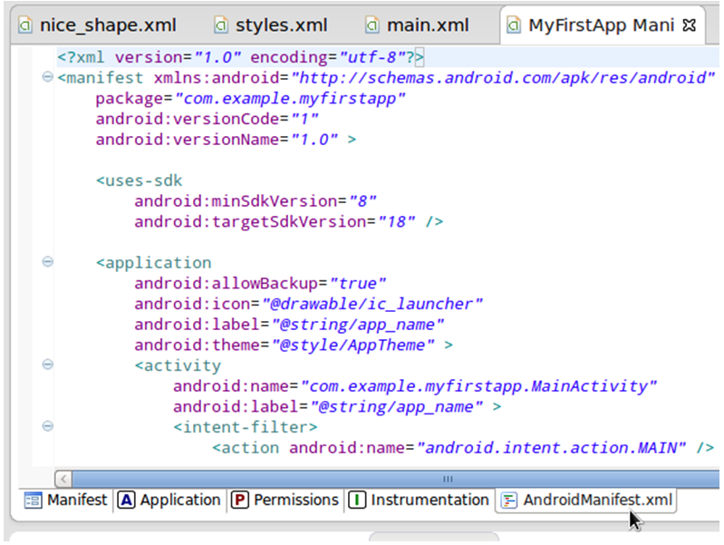

# Android SDK 上手指南：项目清单

> 对于一个项目来说，清单既可以很简单、也可以很复杂，其具体情况要视应用程序而定。我们首先看看清单中那些在所有应用中都不可或缺的组成部分，再进一步探索未来在项目开发中可能涉及的备选组成部分。

在本系列教程当中，我们将共同从零开始学习 Android 开发，同时了解与这套移动平台协作所必需的基础概念及实践。到目前为止，我们已经熟悉了 Android 项目中的各个组成部分，包括其资源。在今天的文章中，我们将以项目清单文件作为核心内容。

**介绍**

对于一个项目来说，清单既可以很简单、也可以很复杂，其具体情况要视应用程序而定。我们首先看看清单中那些在所有应用中都不可或缺的组成部分，再进一步探索未来在项目开发中可能涉及的备选组成部分。

清单文件当中可以包含众多元素与属性，我们不妨点击此处在 Android 开发者指南当中找到关于它们的详细信息。清单拥有几大主要作用：它指定应用程序包、提供应用组件的形式化描述，此外还负责声明权限、必要的 API 级别以及链接库等。我们目前只讨论能够在清单中列出的最为基础的元素与属性，但大家也要知道其中完全可以容纳更多元素、并在所涵盖的元素范围之外使用更多附加属性。

**1. 清单元素**

在 Eclipse 当中打开我们的项目清单文件——大家总能在项目的根目录下找到这份清单。正如前面所提到，大家可以通过多种方式查看清单内容。在底部的编辑器区域中，大家可以看到清单、应用、权限、工具以及 XML 代码等多个标签。现在快速浏览这些标签——我们需要使用 XML 代码，所以请切换到“AndroidManifest.xml”标签。



清单文件中所显示的元素是由 Eclipse 在我们创建项目的同时生成的。但这些只够满足简单应用的需求，在大多数情况下、我们还需要在创建项目时向清单中添加更多元素。文件中的根元素为 manifest 元素：

```
<manifest xmlns:android="http://schemas.android.com/apk/res/android" 
    package="com.example.myfirstapp" 
    android:versionCode="1" 
    android:versionName="1.0" > 
</manifest> 
```

Eclipse 会在项目创建时将大家所选择的包名称作为 manifest 元素的属性。版本代码与名称初始分别为 1 与 1.0。当大家将应用程序提交到 Play 商店中并进行后续次级版本更新时，需要为每一次更新分配一个更新数字。版本名称是用户们在 Play 商店中所看到的应用程序的实际名称，所以大家可以随意使用自己喜欢的数字来表示。用户们是无法看到版本代码的，而且新版本的数字必须高于旧版本——不过每一次递增的幅度并不固定。如果大家尝试向 Google Play 软件商店上传新的应用程序版本，但其版本代码并未高于之前版本的代码，那么 Play 商店将拒绝这一上传操作。

**2. Uses-SDK 元素**

我们在 manifest 元素当中首先见到的应该是 uses-sdk 元素：

```
<uses-sdk 
    android:minSdkVersion="8" 
    android:targetSdkVersion="18" /> 
```

这一元素负责定义最低必要 API 级别以及大家在测试项目时所设定的目标级别。我们在创建应用程序时就需要选择这些相关值。如果需要，大家也可以在项目创建完成后，通过修改清单文件内容进行属性变更。举例来说，大家可能发现自己需要使用某些当前选定 API 级别无法实现的平台功能，这时就需要通过清单文件作出调整了。如果大家改变了 SDK 版本，Eclipse 会重新建立整个项目。

如果用户设备所运行的 API 级别低于项目的最低要求，则无法下载并安装我们的应用程序。列出目标 API 级别代表着我们已经对当前应用版本进行过测试。为保证应用产品的可靠性，大家应该在尽可能多的 API 级别之下进行应用程序测试。

**3. Application 元素**

Eclipse 还会向我们的清单中插入 application 元素。该元素中包含多种子元素，我们将在稍后逐一讨论。现在先来看看打开标签后的内容：

```
<application 
    android:allowBackup="true" 
    android:icon="@drawable/ic_launcher" 
    android:label="@string/app_name" 
    android:theme="@style/AppTheme" >
```
 
需要注意的几种主要属性分别为图标、标签和主题条目。该元素还能够承载多种附加属性。图标属性代表应用可绘制资源中的某个文件。在默认情况下项目会直接使用 Android 图标，但大家可以添加自己的图标文件并将其引用到这里。标签图标引用的同样是来自应用程序资源的字符串。打开名称中包含“res/values”字符串 XML 文件，大家会看到被引用的字符串，内容如下所示：

```
<string name="app_name">MyFirstApp</string> 
```

这应该是一条可读字符串，因为它会显示在用户界面中的多个位置，包括紧靠着启动图标的设备菜单。大家通常需要变更上述字符串内容，例如在表述中加入空格——即“My First App”。

回到清单文件当中，请注意 application 元素的主题属性。它同样引用一种资源，大家可以在“res/values”类型的 XML 文件中找到其具体引用关系，马上去看看吧。接下来切换回清单标签。如果大家稍后决定定义自己的应用程序风格，则可以在主题属性当中对其加以引用。

**4. Activity 元素**

在 application 元素当中，大家会看到一项 activity 元素——它对应着我们在项目开发中所创建的 Activity 类。在 activity 元素中包含有多种子元素，我们稍后再详加讨论。现在先来看看打开后的标签内容：

```
<activity 
    android:name="com.example.myfirstapp.MainActivity" 
    android:label="@string/app_name" > 
```

名称属性利用应用程序包中所限定的路径引用对应类。标签允许我们控制 Activity 启用时、窗口标题中的显示内容。在默认情况下，窗口标题往往就是应用程序名称，因此大家一般不需要再进行额外调整。不过随着应用程序复杂性的提高，大家将向项目中添加更多 Activity——每一个对应 UI 中的一套屏幕显示方案。每一次向应用程序中添加新的 Activity 类时，大家都需要在 application 元素中添加一个对应子元素，如下所示：

```
<activity android:name=".About" > 
</activity> 
```

如大家所见，我们并不总是需要使用完整的应用包名称。上面展示的简写形式也能正常起效，只要 Activity 类（名称为‘About’）仍然处于 manifest 元素所定义的应用包当中即可。Activity 元素能够容纳多种属性，从而决定用户如何与其进行交互。

**5. 意图过滤器**

在主 activity 元素当中，大家会看到一个 intent-filter 元素：

```
<intent-filter> 
    <action android:name="android.intent.action.MAIN" /> 
    <category android:name="android.intent.category.LAUNCHER" /> 
</intent-filter> 
```

这里的 Intent Filter 用于描述主 activity 能够响应哪些“意图”。在 Android 系统中，所谓意图是指在 Activity 启动时向其传递的数据对象。当大家在自己的应用程序中启用一个又一个 Activity 时，就需要使用到意图机制了——不过意图也可以在不同应用之间进行传递。

针对主 activity 的意图过滤器代表前者应该在应用程序运行时被一并启用。意图是通过 action 元素实现这一效果的，也就是上述代码中的“MAIN”操作。另外，category 元素旨在通过分类名称描述意图过滤器，在我们的示例中就是“LAUNCHER”。这两种元素相结合意味着我们的应用程序应该利用 Activity 作为其主入口点，而且该入口点将在应用程序运行时一并启动。

意图过滤器当中可以包含多种子元素，其中包括数据规范。如果大家希望了解更多信息，可以点击此处查看 Android 开发者指南中的“意图与意图管理器”章节。在 activity 元素中，除了 intent-filter 之外还可以包含其它子元素——例如 metadata，其作用是定义一个数据条目的名值对。

**6. 用户权限**

我们已经了解了创建项目时 Eclipse 当中所包含的所有清单元素，现在再来看看今后开发复杂应用时需要涉及的其它元素。某些应用程序需要判断用户是否有权执行特定操作或者查看特定内容，这种与权限相关的功能要靠 uses-permission 元素来实现。当用户在 Play 软件商店中查看我们的应用时，该平台会在应用下载前显示使用全部功能所必需的权限。如果用户选择继续，则需要接受权限控制提示，而后应用才能正常运行。 在清单当中必须强制要求的权限包括使用内部数据、写入外部存储以及访问摄像头等设备功能。我们通过以下示例代码演示这一概念：

```
<uses-permission android:name="android.permission.INTERNET" /> 
```

应用程序还可以强制要求其它几种潜在权限，请大家点击此处查看 API 引用说明中的“Manifest.permission”部分。

**7. 用户设备**

有这样一类清单元素可以被用于描述应用程序运行所必需的硬件及软件功能，其中包括 uses-configuration 元素。在该元素中，大家可以为导航、键盘以及触摸屏选项指定相关要求。在 uses-feature 元素中，大家可以通过功能名称与布尔标记列举关于硬件或者软件的单一功能要求。这些功能包括蓝牙与摄像头选项，例如闪存、位置检测以及传感器。而 supports-screens 元素则允许大家为应用程序定义所支持的屏幕尺寸，所指定的元素可同时涉及尺寸与像素密度。

**8. 其它元素**

我们前面所探讨的元素主要围绕着自己的初始应用展开，但其它不同类型的应用中也有一些元素值得关注。我们为标准应用所创建的初始项目在启动后只涉及用户菜单并为使用者提供一个或者多个 Activity 屏幕。然而其它类型的应用还可能包括功能部件以及持续运行的后台进程——旨在处理数据访问或者接收系统通知。

应用程序通常会利用 Android 系统中的 Service 类来处理后台进程，这就要求我们在清单当中添加 service 元素——与 Activity 类似，service 元素与 Service 类之间一一对应。Android 应用中的内容提供器负责管理对数据源的访问，具体内容被列入 provider 元素当中。最后，清单中的 receiver 元素旨在帮助应用接收来自其它应用或者操作系统本身的意图。

**结论**

到这里，我们已经阐述了 Android 应用的清单文件中，最为基础的各项功能。当大家创建应用程序时，Eclipse 都会同时向清单文件中添加初始项目必需的主要元素。随着在应用中引入更多功能，我们需要不断向清单内增加新内容以确保应用程序整体能够顺利起效。如果大家在开发过程中的实机或者虚拟设备测试出现了问题，很可能是因为清单中缺少某些必要元素。在下一篇系列教程中，我们将一同了解 Android 应用如何存储及访问数据。

原文链接： http://mobile.tutsplus.com/tutorials/android/android-sdk-project-manifest/