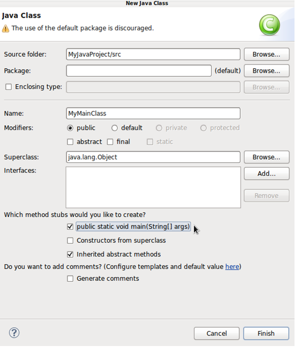
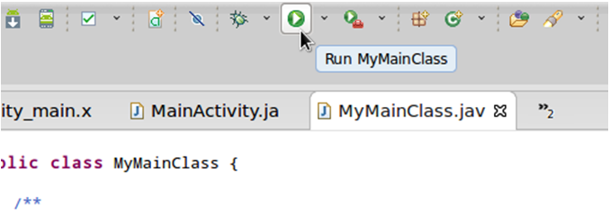

# Android SDK 上手指南：Java 应用程序编程

> 在这份教程中，我们不会过度深入细节，不过如果大家对于某些概念还不大清楚，请点击此处参阅甲骨文 Java 指南。这是一份非常优秀的 Java 语言指导材料，非常适合初学者。

**介绍**

如果大家已经对 Java 非常熟悉，那么不妨直接忽略这部分内容。如果大家的技巧还存在局限或者对 Java 这种语言只闻其名，那么本文将为各位解答很多在 Android 开发当中经常遇到的问题。需要注意的是，这篇文章并不能作为 Java 起步教程来阅读，最多只能算是基础知识汇总。如果对 Java 毫无了解，大家还需要参考其它一些额外的 Java 学习资料。

在这份教程中，我们不会过度深入细节，不过如果大家对于某些概念还不大清楚，请点击此处参阅甲骨文 Java 指南。这是一份非常优秀的 Java 语言指导材料，非常适合初学者。如果在刚刚开始阅读时发现本教程提到的一些内容有些陌生，也请大家千万不要惊慌。只要真正着手开始在 Android 项目中进行尝试，各位很快就能理解本文表达的内容。

**1. Java 语法**

**第一步**

大家已经在我们的 Android 项目中见识过一部分 Java 语法了，但为了清楚起见，让我们再从另一个项目重新学习。这一次我们不再使用 Android 项目，而直接换成 Java 项目——这样大家就能更轻松地感受到我们所使用的结构。打开 Eclipse，点击“New”按钮。在弹出的导航窗口中下滚到 Java 文件夹中并将其打开，选择“Java Project”然后单击下一步。


输入“MyJavaProject”作为项目名称并点击“Finish”。Eclipse 接下来会在工作区内创建我们的新项目。在 Package Explorer 当中，打开新项目文件夹，右键点击“src”并选择“New”、然后选“Class”。这时在 Name 框中输入“MyMainClass”。接着勾选旁边的复选项“public static void main”最后点击“Finish”。



Eclipse 会创建出类并在编辑器中打开。大家不必过多关注项目结构或者类中的现有内容，因为我们的 Android 项目所使用的结构与 Java 项目并不相同。各位可以利用这个项目来磨练自己的 Java 编码技能，在这里代码的运行与测试都要比 Android 应用简便得多，而且我们也能更多地关注 Java 语法本身。

我们在类文件中看到的“public static void main”行就是主方法。无论方法的具体内容是什么，它都会在应用程序运行时加以执行。方法的内容就是显示在“public static void main(String[] args)”后面大括号里的部分。Eclipse 可能还生成了一个“to do”行——直接无视就好。在其后创建新行，我们就从这里开始添加自己的代码。

**第二步**

在 Java 当中，一条变量可以保存一个数据值，例如文本字符串或者数字。当我们在 Java 中创建或者“声明”一个变量时，需要指定其中的数据类型并为其命名。输入以下代码：

```
int myNum; 
```

这一行声明了一个整数变量。我们可以通过以下代码行声明一个变量并为其分配一个值：

```
int myNum = 5; 
```

现在我们可以通过名称引用这条变量了。添加以下代码行，从而将变量值写入到输出控制台：

```
System.out.println(myNum); 
```

大家一般不会在自己的 Android 应用中以这种方式向系统输出写入结果，而是用 LogCat 视图取而代之。不过通过这种输出写入方式，我们能够更为便捷地对 Java 代码进行测试。


**第三步**

现在让我们运行应用。运行过程与 Android 应用存在些许不同，但我们会在稍后继续进行说明。选择“Run”，而后选择“Run Configurations”。在弹出的列表左侧选择“Java Application”并点击上方的“New launch configuration”。如果这是我们的惟一一个 Java 应用，Eclipse 会自动选择运行刚刚创建完成的小小成果。

现在点击“Run”来运行我们的应用程序。大家会看到，编辑器下方的控制台视图中将显示出数字“5”。大家可以利用这种方式在学习过程中对 Java 代码进行测试。

大家现在可以通过工具栏中的“Run”按钮随时运行上一次启动过的项目。



**第四步**

无论何时，只要是在 Java 中进行变量声明，我们都会使用相同的语法。为了在以后的编程工作中为变量分配不同的值，我们可以通过名称对其进行引用：

```
myNum = 3; 
```

上述代码会覆盖掉现有值。在 Java 中存在着很多不同的变量类型。其中 int 属于被引用的基本类型，此外还有一些其它数字类型；char 用于字符值，而 boolean 则用于保存真假值。对象的类型也分许多种；关于对象的话题，我们放在以后进行讨论。对于大家来说，最熟悉的基本对象类型应该要数 String 了，它的作用是保存一条文本字符串：

```
String myName = "Sue"; 
```

文本字符串值要用引号括起来。大家可以在正面的例子中看到它的使用方法：

```
System.out.println("number: " + myNum); 
```

添加上述代码并运行，控制台会显示“number：”再加上变量值。

**第五步**

在上面我们看到了赋值运算符“=”——正面我们再来看其它一些常见运算符：

```
 //add 
myNum = 5+6; 
//subtract 
myNum = 7-3; 
//multiply 
myNum = 3*2; 
//divide 
myNum = 10/5; 
//remainder 
myNum = 10%6; 
//increment (add one) 
myNum++; 
//decrement (subtract one) 
myNum--; 
```

运算符既可以被用在变量当中，也可以作为硬编码数字（如上所示）：

```
 int myNum = 5; 
int myOtherNum = 4; 
int total = myNum+myOtherNum;//9 
```

**第六步**

作为 Android 基础内容的另一种 Java 结构就是注释。大家可以通过以下两种方式添加注释：

```
 //this is a single line comment 
/* This is a multiline comment 
* stretching across lines 
* to give more information 
*/ 
```

最重要的是养成编写代码的同时添加注释的好习惯，这一方面便于我们自己日后查看，另外也能让其他合作者了解我们的编码意图。

**2. 控制结构**

**第一步**

我们向主方法中添加的代码会在 Java 应用程序运行时同时执行。而在运行我们所创建的 Android 应用程序时，主 Activity 中 onCreate 方法的代码会同时执行。这些方法中的所有代码行都会按从上到下的顺序依次执行，不过执行的流程并不总是线性的。Java 当中有很多控制结构，正面我们就从条件开始了解其中最常见的几种。条件语句一般用于进行测试从而确定执行流程。在 Java 当中，最简单的条件结构就是 if 语句：

```
if(myNum>3) 
   System.out.println("number is greater than 3"); 
```

这项测试的目的在于检查变量的值是否大于 3。如果确实大于 3，那么字符串将被写入输出结果。如果小于等于 3，则不向输出结果写入任何内容、继续执行程序中的下一行。条件测试会“返回”一个真假值。真与假都属于 boolean 值。我们也可以向其中添加 else，这样其内容只会在返回假值时才执行：

```
 if(myNum>3) 
    System.out.println("number is greater than 3"); 
else 
    System.out.println("number is not greater than 3"); 
```

在我们的示例中，else 语句会在值等于或者小于 3 时执行。尝试在代码的整数变量中添加不同的值，看看条件测试结果会发生哪些变化：

```
 if(myNum>10) 
    System.out.println("number is greater than 10"); 
else if(myNum>7) 
    System.out.println("number is greater than 7"); 
else if(myNum>3) 
    System.out.println("number is greater than 3"); 
else 
    System.out.println("number is 3 or less"); 
```

只有在流程中的每一次测试中都返回假值时，所有测试行才会被彻底执行一遍。因此对于大部分数字来说，只会输出一条字符串。如果有必要，大家可以把多条 else if 语句串点起来。大家还可以利用 if 语句与一个或者多个 else if 相结合，而不必每一次都在之后单独设置 else。

下面我们测试一个数字是否大于另一个。尝试使用以下变量：

```
 if(myNum<10) 
    System.out.println("number less than 10"); 
if(myNum==10) 
    System.out.println("number equals 10"); 
if(myNum!=10) 
    System.out.println("number is not equal to 10"); 
if(myNum>=10) 
    System.out.println("number either greater than or equal to 10"); 
if(myNum<=10) 
    System.out.println("number either less than or equal to 10"); 
```

大家也可以利用包含字符串的变量类型进行类似的测试。要同时进行多项测试，可以利用以下语法：

```
if(myNum>=10 && myNum<=50) 
    System.out.println("number is between 10 and 50"); 
```

其中的“&&”是作为“and”运算符存在的，意思是整条语句只有在两项测试都返回真值时才被判定为真。而“or”运算符将在两条测试中任意一条返回真值时判定为真：

```
if(myNum<0 || myNum!=-1) 
   System.out.println("number is less than 0 or not equal to -1"); 
```

为了将代码组成代码块，我们可以使用大括号——两个括号之间的所有代码都会在测试返回真值时执行：

```
 if(myNum<10) 
{ 
    System.out.println("number less than 10"); 
    myNum=10; 
} 
```

这些括号能够在循环、方法以及类中实现代码分组。

**第二步**

接下来让我们看看循环。下面的 for 循环会进行十次遍历，意味着它的内容将执行十次：

```
  for(int i=0; i<10; i++){ 
    System.out.println(i); 
} 
```

在 for 循环中的第一个表达式旨在将一个整数型计数器变量初始化为零。第二个表达式则是条件测试，检查该变量的值是否小于 10。如果返回的是真值，则循环内容得到执行；如果返回的是假值，则中止循环。一旦循环当中的内容开始执行，第三个表达式就同时执行，即递增计数器。

另一种循环 while 所使用的语法稍有区别。以下代码就是我们利用 while 来实现上面的 for 循环的相同执行效果：

```
 int i=0; 
while(i<10){ 
    System.out.println(i); 
    i++; 
} 
```

循环当中可以容纳多行代码，其中包括其它循环。

**第三步**

我们已经接触了主方法与 Android 的 onCreate 方法。下面让我们一起学习如何创建自己的方法。将以下方法放置在主方法的右括号之后：

```
 public static void doSomething(){ 
    System.out.println("something"); 
} 
```

该方法被定义为 public，这意味着项目中的所有类都可以调用其进程。如果它的属性为“private”，则代表只供同一个类内部进行访问（也就是‘visibility’）。一般来说，大家不会在自己的第一个 Android 应用中包含“static”修饰符，因此忽略掉它即可。而“void”代表着返回类型。在我们的示例中，该方法不会返回任何值。为了执行该方法，我们需要在主方法中添加一项调用：

```
doSomething(); 
```

运行应用程序并查看其功能——改变方法以返回一个值：

   public static int doSomething(){ 
    return 5; 
} 
改变方法调用并再次运行：

```
System.out.println(doSomething()); 
```

返回的值会被写出。方法还可以接收参数：

```
public static int doSomething(int firstNum, int secondNum){ 
    return firstNum*secondNum; 
} 
```

在调用该方法时，大家必须符合正确的参数类型与数字：

```
System.out.println(doSomething(3, 5)); 
```

方法能够将应用程序进程拆分为逻辑块。如果大家需要多次执行同一项任务，那么它们的作用将非常重要；我们可以简单在方法中进行定义，然后在需要时随时调用。如果各位需要改变处理流程，也只需在方法代码中进行修改。

**3. 类与对象**

**第一步**

我们已经了解了方法如何被用于重新使用代码并将其拆分成逻辑部分。类与对象则能够在更大的范围内实现此类功能。大家可以将应用中的任务划分成不同对象，其中每个对象都由它所归属的类为其定义一系列职责。这类似于用一种方法负责一个特定功能区域，不过一个对象可以拥有多个方法而且能够保存数据值。

想象我们正在创建一款游戏——大家可以创建一个专门用来处理用户详细信息的类。在 Package Explorer 中选择我们的应用程序包，右键点击并选择“New”而后是“Class”。输入“GameUser”作为类名称，确保 main method stub 复选框没有被勾选，然后点击“Finish”。Eclipse 会打开这个类文件，在初始状态下其中只包含它的类声明概要：

```
  public class GameUser { 
//class content 
} 
```

大家所添加的所有内容都应该位于两个大括号之间（除非大家添加导入语句，这部分内容将位于最前方）。我们的 Android 应用会识别出罗列于文件开头的包名称。当然这里我们使用的是默认包，所以前面并没有列出其它内容。

**第二步**

在这个类当中添加以下变量：

```
private String playerName; 
rivate int score; 
```

这些被称为“实例变量”，因为它们被定义为我们所创建的类中的实例。在它们之后添加一个构造方法，它会在该类中的某个对象被创建后开始执行：

```
public GameUser(String userName, int userScore){ 
   playerName=userName; 
   score=userScore; 
```

这里的构造永远与类使用同样的名称，而且可能要求也可能不要求使用参数。该构造通常应该向实例变量分配值，一般是通过参数来实现。

**第三步**

类也可以定义方法。将以下典型集合添加到构造之后：

```
  public String getName() {return playerName;} 
public int getScore() {return score;} 
public void setName(String newName) {playerName=newName;} 
public void setScore(int newScore) {score=newScore;} 
```

这些被称为 get 与 set 方法，或者叫 getter 与 setter，因为它们会利用接收及发送实例变量值的能力将外部代码添加到类中来。查看 Eclipse 中的 Outline 视图，理解它如何帮助实现导航类内容。


**第四步**

保存我们新建的类文件。回到主类当中，为新类在主方法中创建一个对象：

```
GameUser aUser = new GameUser("Jim", 0);
```
 
我们符合构造当中的参数要求——以上代码中的“new”关键字将使构造开始执行。现在我们可以使用这个类实例，通过调用其方法访问其中的数据：

```
System.out.println(aUser.getScore()); 
aUser.setScore(5); 
System.out.println(aUser.getScore()); 
```

运行程序以查看调用对象上的 public 方法之后，值产生了什么样的变化。大家可以创建多个对象实例，并对它们进行分别管理：

```
GameUser anotherUser = new GameUser("Jane", 5); 
```

**4. 继承与界面**

**第一步**

我们已经了解了如何通过创建对象实例来使类定义一系列职责。它的效果不仅作用于我们所创建的类本身，同时也作用于其它我们能够使用的现有 Java 及 Android 类。除此之外，在创建这些平台类实例的同时，大家还可以利用继承对其加以扩展。在继承机制的帮助下，我们可以创建出一个继承现有类功能、同时又拥有自己运行流程的类。在我们所创建的第一个 Android 项目中，主 Activity 类就是一个很好的例子。

现在打开 Android 项目中的这个类。在类声明的开头，大家会看到“extends Activity”。这意味着该类属于 Android Activity 类中的一个子类。这里的 Activity 类用于使 Android 系统处理向用户呈现的屏幕内容，而各方法则用于不同变量状态下的屏幕内容（创建、暂停与消除等）。通过向 Android Activity 类声明中的定义方法添加代码并在必要时增加额外方法的方式，我们能够更专注于实现应用程序的独特风格。

这是我们经常会在 Android 上使用的模式，用于为应用程序的常见需要扩展定义类。大家可以用自己的类适当对其加以补充。

**第二步**

再来看 Activity 类中的起始行。请记住，我们添加了“implements OnClickLisener”来处理 UI 中的按钮点击操作。这将通过引用被实施在界面当中。界面类似于一个我们利用“extends”继承而来的类，只不过界面声明只需简单罗列方法概述。大家需要对每一项概述进行方法实施。因此当我们实施 OnClickListener 时，需要委托该类提供一个 onClick 方法——正如我们在之前的 Android 项目中所做。因此界面类似于一项协定。在继承机制的辅助下，扩展类能够继承由类声明所提供的、用于实现超类（即经过扩展的类）的方法实施。如果需要，大家可以覆盖这些实施内容。

**总结**

在今天的教程中，我们简要介绍了一些 Java 语法方面的基本知识。当然，还有很多其它关于 Java 的结构与概念需要了解。如果大家此前没有接触过 Java，又希望保证自己能拥有足以顺利应对 Android 开发工作的必要知识，请务必点击此处认真阅读甲骨文公司发布的 Java 指南。其中需要认真学习的主题包括数组与交换语句。在本系列的后续文章中，我们将探讨一些大家最常用到的 Android 类。而在下一章节中，我们则开始探索 Android 应用项目中的资源。

原文链接： http://mobile.tutsplus.com/tutorials/android/android-sdk-java-application-programming/