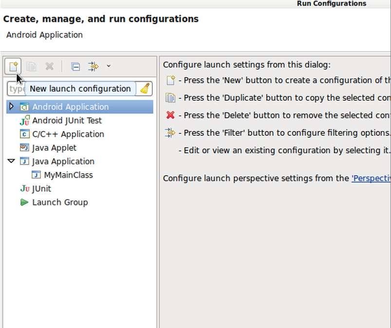
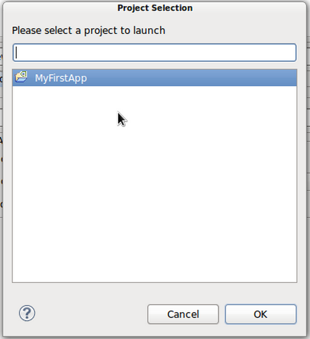
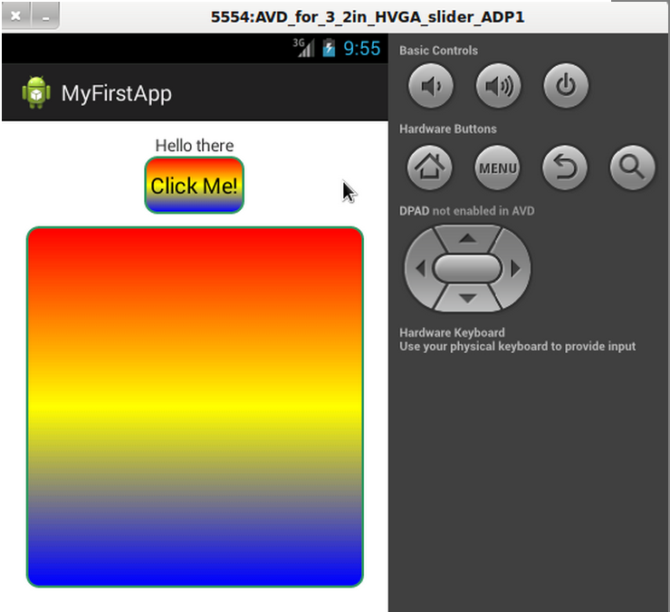
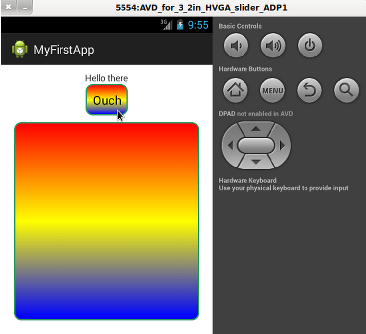
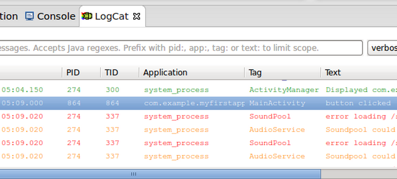
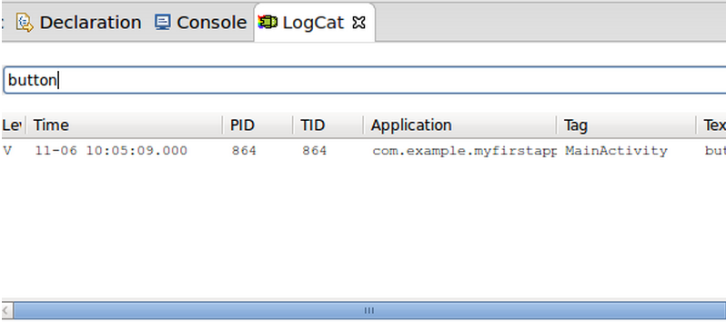
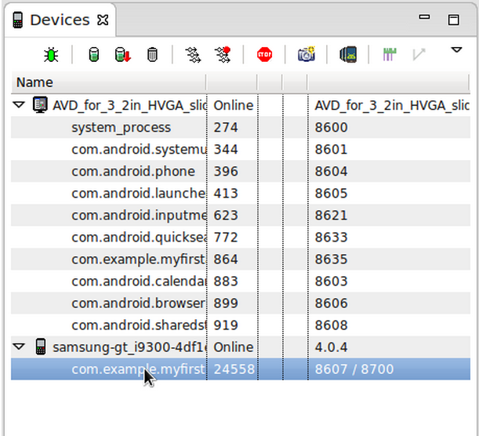
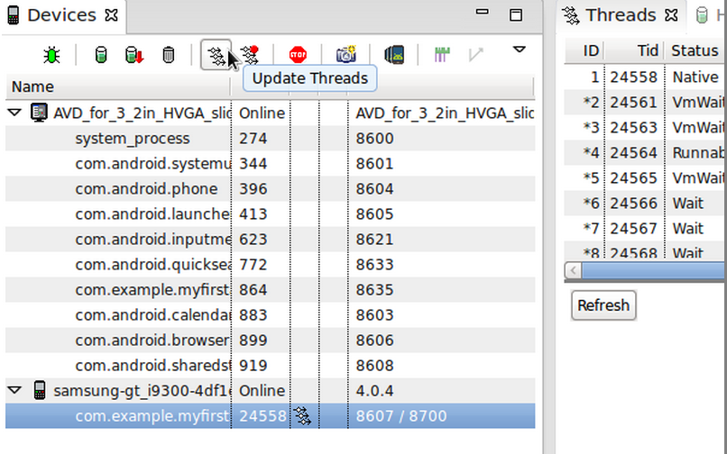

# Android SDK 上手指南：运行与调试

> 我们在本系列教程当中已经学习了关于 Android 应用程序开发的不少知识。在上一篇文章中，我们了解了如何将硬件与虚拟设备同 Eclipse 进行对接。

我们在本系列教程当中已经学习了关于 Android 应用程序开发的不少知识。在上一篇文章中，我们了解了如何将硬件与虚拟设备同 Eclipse 进行对接。而在今天的指南里，我们将探索如何通过 Eclipse 在物理设备及 Android 虚拟设备（简称 AVD）上进行应用程序运行与调试。

**介绍**

对于一直在关注本系列 Android 应用程序开发教程的朋友来说，首先需要强调一点：我们在之前文章中创建出的应用程序暂时还没什么实际用处，但我们可以通过它来体验应用的运行流程，并以此为基础介绍一些非常重要的 Eclipse ADT 实用程序。随着大家开发水平的提高，未来的新应用必然会变得更先进也更复杂，到那时我们现在所介绍的调试工作将扮演极为重要的角色。在完成了今天的指南后，大家可能希望花点时间对自己创建的应用作出调整，而后尝试将其运行在物理或者虚拟设备上。掌握了这种方法，大家就可以在开发过程中定期将应用程序半成品运行在设备之上，从而实现边开发边调试的理想效果。

**1.运行**

**第一步**

当我们在虚拟或者物理设备上编译并运行自己的 Android 应用时，Eclipse 会处理大部分必要的细节工作。Eclipse 以及 ADT 会为我们的应用创建一个 APK 文件，同时将其安装在我们所使用的设备上。APK 文件也就是用户们从 Google Play 商店中所下载的应用文件格式。不过大家还需要进行额外一些步骤来进行应用程序的发布，这些内容我们将在之后的教程中一一说明。总之，Eclipse 会首先建立一个用于调试的 APK 文件，我们可以通过这套 IDE 将其直接运行在设备上。

相信大家已经通过上一篇指南文章了解了如何利用相关技术启动自己的 AVD 或者将硬件设备与计算机相连。我们将让应用程序运行在接入的设备之上。无论是虚拟还是物理设备，都必须满足我们在应用程序清单当中所指定的最低 API 级别，否则将无法正常运行应用对象。

**第二步**

现在我们可以首先为自己的应用程序创建一套运行配置方案。在 Eclipse 当中，选择“运行”而后选择“运行配置”。在运行配置窗口左侧，大家将看到可以运行的应用程序类型清单。在其中选择“Android 应用程序”然后点击上方的新建按钮。

在打开的新配置项目当中，在名称栏内输入一个名称以替代现有文本。请大家选择一个清晰的名称，让自己能够明确区分不同应用程序。现在点击“浏览”按钮，在其中选择自己的应用程序项目，而后点击“OK”。

点击“目标”选项卡。大家可以让 Eclipse 自动选择要启动应用程序的设备，也可以将其设置为每次运行应用程序时都提醒用户手动选择。这套选项只适用于同时有多种设备接入 Eclipse 的情况，例如一台硬件设备与一套 AVD。

请注意，我们的应用程序现在已经被列举在运行配置清单的 Android 应用程序当中。当一切准备就绪之后，大家可以从这里进行应用程序启动——相信在未来的实际工作中，各位的工作区内还将包含更多应用。

点击“运行”。如果大家在配置中设定了每次运行前提示用户选择一种设备，那么 Eclipse 这时就将提供对应选项。选择当前要使用的物理或者虚拟设备。如果我们没有接入设备或者运行 AVD，但又在设定中要求 Eclipse 自动选择设备，则系统会启动一套适用于当前情况的 AVD。大家也可以通过 Eclipse 工具栏中的“运行”按钮来启动上一次应用程序所使用的运行环境，这就省去了每一次打开运行配置窗口的麻烦。

提示:在应用程序运行配置的“目标”选项卡中，如果大家向下滚动则会看到多种模拟器选项，其中还包含命令行区域。大家可以[点击此处](http://developer.android.com/tools/help/emulator.html)查看使用 AVD 过程中可能需要的各种命令行参数。

**第三步**

当我们运行自己的应用程序时，Eclipse 会将 APK 复制到目标设备当中、进行安装并启动主 Activity。

大家应该还记得我们当初在按钮上建立的这套基本用户交互机制；点击按钮来改变显示文本内容（在 AVD 当中使用鼠标模拟点击操作，在实机上则使用手指进行触控）。

**第四步**

在大家开发自己的应用程序时，很可能需要重复将当前成果加以进行、编辑内容然后再次运行。在这种情况下，Log 将成为我们使用频率最高的主要工具之一。在 Java 文件当中，我们可以编写输出至 LogCat 的相关信息来帮助自己更顺畅地完成开发与调试工作。在我们的主 Activity 类中，将以下实例变量添加到原有类内容之前：

这是一条标记常量，我们通常利用它来编写日志输出信息；通过类名称，我们可以更明确地看到当前日志信息来自哪个类。在 onClick 方法中，将以下代码添加到按钮文本设定部分之前：

大家需要将“android.util.Log”导入到自己的类当中。在向 Log 中写入内容时，我们可以从多种方法中作出选择，从而表达与目的相符的对应信息。在上述代码中，我们用 v 来指代详细（verbose）。大家还可以用 d 来指代调试信息（debug message）、i 指代信息（information）、w 指代警告（warning）并用 e 指代错误（error）。

现在保存我们的文件并通过“运行”按钮再次运行应用程序。请大家确保自己已经在 Eclipse 当中打开了 LogCat View。再次点击设备或者 AVD 上的 UI 按钮。现在向下滚动 LogCat View 直至我们找到对应的运行信息。

正如大家所见，以上彩色信息反映每种情况下 Log 方法的实际运行情况。我们可以通过在文本框中输入内容的形式搜索信息，这一点在显示信息量较大的时候非常有用——例如使用硬件设备运行应用程序时。

提示:如果大家发现自己在使用 LogCat View 时 Eclipse 停止响应或者崩溃，则需要在“窗口”——>“偏好设置”——>“Android”——>“LogCat”中设置 LogCat 信息的最大缓冲数量。如果这样的调整仍然无法解决问题，请进一步降低缓冲数量并再试一次。

**2.测试**

我们在今天的文章当中不会讨论太多测试方面的细节，因为这是一项非常重要也相当重复的工作、将成为大家未来 Android 学习过程当中的主要课题之一。在准备好进行测试之后，大家可以在 Eclipse 当中创建一个测试专用项目。Android 开发者指南当中专门提供了“[测试基本原理](http://developer.android.com/tools/testing/testing_android.html)”与“[Activity 测试指南](http://developer.android.com/tools/testing/activity_test.html)”两个章节，从深层次讲解了 Android 平台上的测试知识。测试工具全部以 JUnit 为基础，作为汇聚专有 Android 测试资源并加以扩展的解决方案，JUnit 专为 Android 开发工作而生。如果大家已经熟悉了对 Java 代码的测试工作，那么应该会更清楚自己需要在 Android 应用测试当中做些什么。

**3.调试**

**第一步**

尽管大家并不需要马上对应用程序进行调试，不过我还是要通过今天的文章为大家初步介绍 DDMS（即 Dalvik 调试监控服务器）以及这些工具能为开发流程带来的实际价值。我们已经了解了 Eclipse 当中的一种调试 View，也就是 LogCat；不过另外几种同样值得大家认真掌握。

在运行在或者连接着 Eclipse 的虚拟设备或者硬件设备上，我们可以通过选择“窗口”、“打开视图”、“DDMS”的方式开启 DDMS 视图。在这里，大家能够利用 Eclipse 右上方的按钮在 DDMS 视图与 Java 视图之间进行切换。

**第二步**

让我们就 DDMS 视图展开探讨。上一次我们已经了解过设备视图（其中会显示一份清单，罗列所有已经连接的设备外加运行其中的进程链接）。选择一项进程后即可访问设备视图中的各按钮。正面通过名称从列表中找出我们自己的按钮。

在选中对应进程之后，点击设备视图中的“Update Threads”按钮以开启 Threads View。

“Update Heap”按钮对于 Heap View 也将起到同样的作用。在未来的开发工作当中，大家还会根据需要了解其它视图的作用，其中一些只与执行特定任务类型的应用程序相关。不过现在我们不考虑太多，只把时间用在 DDMS 当中值得关注的内容身上。

模拟器视图提供针对任何运行中虚拟设备实例的控制选项，大家可以在设备列表中选择一套 AVD 并打开其模拟器控制选项卡来查看相关内容。另外，需要注意的是我们可以在设备视图当中停止当前运行着的进程、调试运行中进程并强制执行垃圾回收。在我们结束对 DDMS 的说明之前，应用程序一定正运行在硬件或者虚拟设备之上，请在设备视图中选择对应设备并点击“截图”按钮。

这时新窗口中将出现当前设备显示内容的截图结果。在这里，大家可以保存或者复制该图片，并将其用于应用程序商店中的宣传资料当中。受篇幅所限，我们对调试工作的说明比较简略，大家可以[点击此处](http://developer.android.com/tools/debugging/index.html)查看 Android 开发者指南当中关于 Android 应用程序调试的内容。

**总结**

当我们开始着手创建 Android 应用程序时，需要关注的重点在于运行应用程序并将信息记录到控制台以监控应用的运行活动。不过随着项目复杂程度的提升，大家往往会在应用程序发布前的准备阶段用到大量 Eclipse 当中不可或缺的 Android 调试与测试工具。在本系列教程的下一篇文章中，我们将介绍 Android Activity 生命周期，只有掌握了这方面知识、大家才能真正开始创建功能全面的应用程序。

原文链接：

http://mobile.tutsplus.com/tutorials/android/android-sdk-running-debugging/