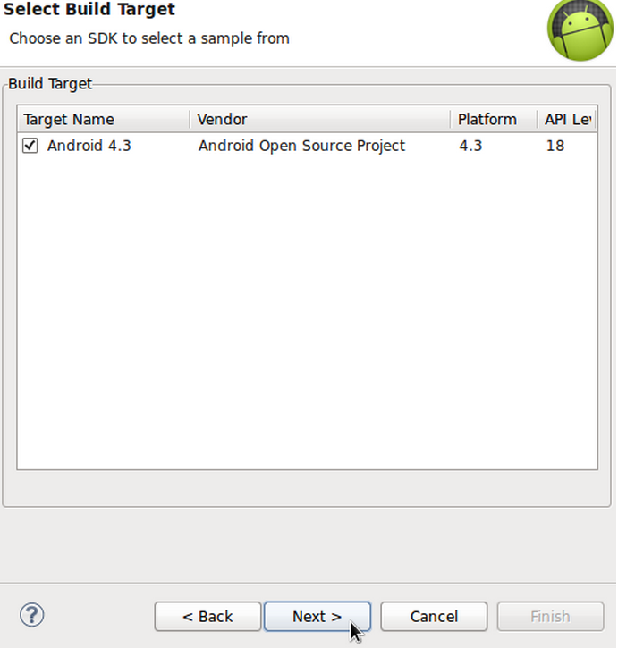

# Android SDK 上手指南：示例项目

> Android SDK 示例项目中的应用能够执行种种功能，例如各类用户界面元素、数据管理、交互、媒体及连接使用说明等。即使大家不打算在自己的开发过程中用到示例所包含的某些特定应用类型，其中的大部分功能仍然适用于其它不同类型的应用。

**介绍**
Android SDK 示例项目中的应用能够执行种种功能，例如各类用户界面元素、数据管理、交互、媒体及连接使用说明等。即使大家不打算在自己的开发过程中用到示例所包含的某些特定应用类型，其中的大部分功能仍然适用于其它不同类型的应用。总而言之，这些示例资源值得大家值得探索一番。

**1.安装**
**第一步**
要在 Eclipse 当中直接使用 Android 示例项目，大家首先需要确保自己已经将其正确安装到位。在“Android SDK Manager”当中选择“Window”，在拉下来的软件包列表当中大家会在每个 API 级别的文件夹当中找到不同示例——选择最新的一个然后将其展开。如果其中的“Samples for SDK”尚未安装，现在就将其选中并安装。

示例项目安装完成之后，大家就可以在 Eclipse 当中直接找到它们了。请记住，我们在本系列教程的前几篇文章中谈到过如何利用 SDK Manager 保持 Android SDK 工具处于最新状态，因此请各位在当前拥有可更新内容时马上进行安装。

**2.创建示例项目**
**第一步**
大家可以在 Eclipse 当中创建一个示例项目，从而查看该示例中的代码并在物理或者虚拟设备上加以运行。这样我们就能通过复制和粘贴来借用示例当中所涉及的算法，或者通过解读与学习把握概念、今后用在自己的应用程序当中。要在 Eclipse 当中创建示例项目，需依次选择“File”、“New”然后是“Project”。展开 Android 文件夹之后，选择“Android Sample Project”然后点击“Next”。

选择一个创建目标并点击“Next”。

现在大家可以从示例列表当中作出选择，其中包括早期遗留示例——大部分属于全功能应用，包含我们可能在首次应用开发工作中所需要的处理流程类型。大家可以在业余时间慢慢研究这些示例，但作为初次接触、我们这里先选择“Notpad”示例并点击“Finish”。

Eclipse 会在我们的工作区当中利用示例代码创建应用，过程与创建我们自己开发的应用一样。完成后，大家应该可以在自己的 Package Explorer 当中找到 Notepad 应用了。展开该应用的文件夹，我们还可以进一步查看其中的内容。

**第二步**
大家可以花点时间看看示例项目当中所包含的各个文件，其中包括 Manifest、source doe 以及 resource files，例如布局、可绘制对象、值以及菜单等。Notepad 应用对于初学者来说算是很好的资源，大家可以通过它了解 Android 平台上很多常见的功能类型。现在让我们打开 Manifest 文件并切换到 XML 选项卡。

大家不要被示例文件当中复杂的文件结构所吓倒。如果各位在 Eclipse View 当中查看这些内容，特别是采用 Outline View，肯定会看到它们与我们在前几篇文章中开发过的应用拥有同样的整体结构。

源文件当中通常包含大量代码注释，因此如果大家不能确定特定代码段的具体含义、完全可以从注释当中得到解答。在 Outline View 当中展开元素，我们会看到 NotesList Activity 将以应用程序 main launcher Activity 的形式被详细列出。由于这是在系统上进入应用程序的主要入口，因此我们可以将其作为很好的应用源代码探索起点。

**第三步**
在花时间浏览过其它 Manifest 内容之后，打开 Notepad 应用 src 文件夹下的 NoteList Activity。

如大家所见，所有源代码都拥有良好的注释，不仅该类的作用拥有详尽说明、其中每个方法以及各方法的组成部分也经过了解释。下面请在 Outine View 当中查看 onCreate 方法。

大家可以很直观地发现，onCreate 方法中的代码与之前我们所看到的 ListActivity 只存在细微的差别。我们发现列表当中的每个条目都会引用同一种布局，也就是 noteslist item。打开应用程序的 res 布局文件夹并找到该布局。大家可以在该布局条目的标记与图形视图之间进行切换，这一点我们之前也已经说明过了。

大家可以利用这种通用型方式探索所有示例应用，即浏览各种组成元素、以逻辑方式遵循引用关系逐步查看各个源文件。

**第四步**
大家可以在物理设备或者 Android 虚拟设备（简称 AVD）上运行这些示例应用，具体方式与运行自己开发的应用程序完全相同。让我们再次捋清思路：接入一台设备或者启动 AVD，而后进入 Run Configurations。在其中选择 Android Application，点击 New 按钮并利用 Browse 按钮定位要运行的示例应用。如大家所示，运行示例应用的过程与运行自己创建的应用并无二致。

如果大家在开发应用程序时用到了与示例应用当中类似的功能，则可以将示例应用内容打开并安置在自己的应用旁边，从而以此为参考开发自己的算法。Notepad 示例这类应用程序当中包含多种非常典型的处理过程，例如通过 Content Provider 处理数据——我们可以在 NotePadProvider 类当中看到这部分代码。示例应用的设计初衷在于向开发者展示如何在 Android 平台上完成特定任务，因此大家在遵循《Android 开发者指南》的说明时这些示例能够起到很好的辅助作用。

提示:当我们使用 Android SDK 当中的早期遗留示例时，会发现 Eclipse 显示关于废弃代码的警告信息。这是因为早期遗留示例是针对早期 SDK 版本创建的。如果大家希望使用被 Eclipse 列为“不推荐”的任何功能，请首先查看新版本 Android SDK 中是否提供更新更有效的替代方案。

**第五步**
请大家随意探索 SDK 示例中的代码内容，很多示例内容的含义都非常清晰。不过有时候其内容功能与示例名称之间的关系可能没什么直接联系。其中最值得关注的示例要数 APi Demos，大家可以按前面介绍的方法在 Notepad 应用列表中找到它。

先利用 APi Demos 示例启动一个示例项目，如前文所述将其在 Package Explorer 当中展开，然后打开 src 文件夹。该应用会被拆分为多个包，各自对应不同的功能类型。我们可以从这里看到并学到很多实用的知识。打开其中一个包，查看它所包含的各个类。与其它示例代码一样，这部分代码同样拥有详尽而明确的注释，能够帮助大家理解每个类及方法的实际作用。API Demos 应用当中包含图形、动画、媒体、安全以及可访问性几大功能。

**3.示例的其它使用方法**
在 Eclipse 当中创建示例项目是最简单也最实用的学习方法，能够帮助大家透彻掌握 Android SDK 所提示的说明性代码内容。不过我们还可以通过其它方式来充分利用 SDK 示例代码。大家可以在自己的计算机上从 ADT Bundle 目录中找到各个示例项目的具体文件。在其中的 sdk 文件夹内，大家会看到一个名为 samples 的文件夹。我们在各个平台层面上已经安装过的示例都能在这里找到，而且它们都拥有自己的专有文件夹。在该文件夹中，大家还会看到被划分为不同示例类型的文件夹。我们可以通过这种方式浏览、打开并与源代码文件进行交互。

在 Android 开发者网站的 Samples 部分，大家可以下载并查看该平台上的各种示例代码。这些示例旨在与利用 Gradle 创建的 Android Studio 相协作。大家可以下载完整的项目并将其导入至 Android Studio 当中，从而在该 IDE 下与这些内容进行交互或者将应用运行在 Android 设备之上。

**总结**
Android 示例当中包含大量功能。尽管其中一部分早期遗留内容现在看起来有点过时，但作为学习材料仍然具备良好的价值。如果大家发现自己打算开发的功能在示例项目中已经存在，那正好能省下大量的开发时间——只需对 SDK 给出的内容稍加改动即可。在本系列的下一篇文章中，我们将探讨在应用程序开发并测试结束之后，该如何将成果发布出去。

原文链接：

http://mobile.tutsplus.com/tutorials/android/android-sdk-samples/