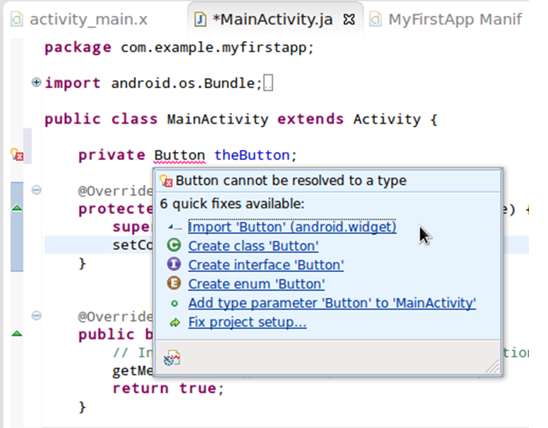
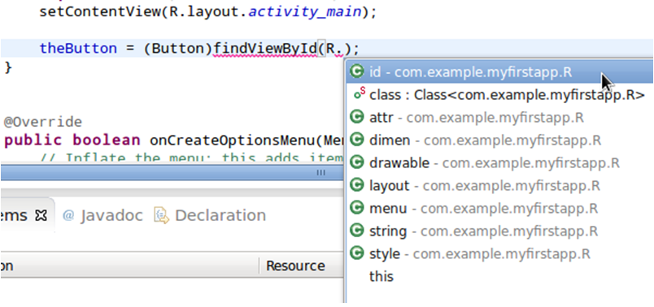
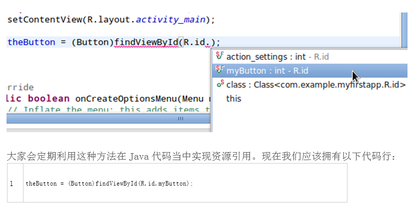
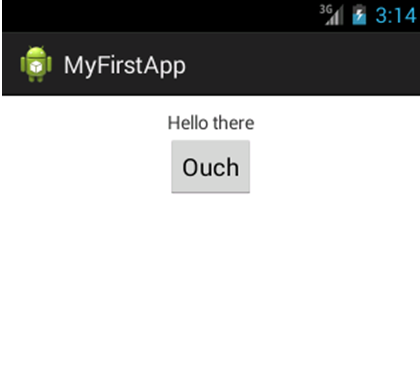

# Android SDK 上手指南：用户交互

> 在这篇教程中，我们将对之前所添加的 Button 元素进行设置以实现对用户点击的检测与响应。为了达成这一目标，我们需要在应用程序的主 Activity 类中略微涉及 Java 编程内容。

在这篇教程中，我们将对之前所添加的 Button 元素进行设置以实现对用户点击的检测与响应。为了达成这一目标，我们需要在应用程序的主 Activity 类中略微涉及 Java 编程内容。如果大家在 Java 开发方面的经验不太丰富也没必要担心，只要按步骤进行即可完成学习。我们将在本系列的下一篇文章中深入探讨 Java 语法，从而保证大家了解初步 Android 开发任务中所必需的编程语言知识。

大家可以在 Android 当中以多种不同方式实现用户交互。我们将学习两种最为典型的处理方案，从而实现应用按钮对用户点击的感应——两种方案都会用到一点 XML 代码以及 Java 实施流程。Android 当中包含几种不同的交互 UI 元素，足以感应来自用户的各类输入操作。输入操作的处理方式必须与 UI 项相匹配，但整个过程仍然大体相同。我们将以一个按钮为起点开始探索 Android 平台上的用户交互，因为按钮无疑是最简单也最常用的界面元素。

**1.用户交互基础**

在进一步探讨细节之前，我要首先为刚刚接触应用程序开发工作的朋友们解释几项 UI 概念。为了实现应用交互，我们需要利用特定元素检测用户的交互操作。看过上一篇文章的朋友一定还记得，Android 中存在 View，而在今天的示例中具体是指 Button。要实现交互，我们首先需要“监听”用户的操作。虽然 Android 主要运行在搭载触控屏幕的移动设备上，但大家仍然可以在计算机上利用编程语言处理交互开发。举例来说，在后面提到“点击”的部分，我们指的是利用鼠标点击或者用手指触摸/点触对应位置。

用户与应用程序的交互方式是多种多样的。他们可以点触、划动以及“长按”对应项目。当这些操作活动发生时，我们将其称为一个“事件”。因此，我们需要通过设置让应用程序监听特定 UI 项目上是否发生了特定事件。在今天的示例中，我们需要监听针对 Button 的点击（或者点触/触摸）操作。

我们需要监听并响应这类用户事件。要做到这一点，我们将向 Java Activity 类中添加代码以实现对按钮点击的监听与响应。只要按钮上出现点击事件，这部分代码就会开始执行。虽然其它类型的用户交互会涉及不同的方法代码以及多种多样的事件类型，但其基本过程都是相通的。

**2.识别 UI 元素**

**第一步**

为了指明用户交互具体指向哪个 View，我们需要在应用程序当中识别出每个交互性 View。在文章列举的范例中，我们只讨论一个 View——但大家在今后实际进行应用开发时，可能会用到多种不同类型的交互性 View。为了让它们彼此之间有条不紊地运作，我们需要为每个 View 设置一个用于识别的独特 ID 属性，并将其应用于整个应用程序。首先在 Eclipse 中打开我们的主布局文件并切换到 XML 编辑标签。接下来找到我们为 Button 元素添加的代码，利用以下语法为其分配一个 ID：

```
android:id="@+id/myButton" 
```

我们需要为 Android 布局中所使用的每一个元素分配 ID 属性，从而帮助自己顺利识别每个 View 元素。请注意以上代码中的“@+id”语法。这会提示 Android 工具在项目资源“R.java”文件中创建一个新 ID，并为其指定一个在应用程序内独一无二的文本字符串，也就是“myButton”。在应用中 XML 布局代码的其余部分乃至其它 XML 与 Java 文件内，我们将使用这一名称来指定 Button View。而后保存当前布局文件。

**第二步**

打开应用程序中的主 Activity 文件。我们将向其中添加一点点 Java 代码，但大家不用为自己令人捉急的 Java 水平而担忧，只要理解其中与处理用户交互相关的大致流程即可。如果各位朋友原先从未接触过 Java，请继续关注我们的下一篇教程，到时候回头再看就会发现现在的内容其实非常简单。我们要在 Activity 类中创建一个变量来引用 Button View。在类声明开头、起始内容之后：

```
public class MainActivity extends Activity { 
```

添加变量声明：

```
private Button theButton; 
```

我们的声明包含视觉特性（下一次再详加说明）、变量类型以及变量名称。Eclipse 可能会在“Button”文本部分加注下划线并提示“Button 不能被解析为一个类型”。由于我们使用的是由 Android 平台所提供的 Button 类型，所以必须将其导入至类文件当中。将鼠标悬停在“Button”文本上方，Eclipse 将为我们显示出一套建议列表。在其中选择“Import‘Button’（android.widget）”。这样类文件顶部就会出现一个可以自由展开与收起的导入声明列表。



**第三步**

现在我们可以在布局当中取回指向 Button View 的引用，并将该引用保存在我们所创建的变量当中。在我的 Activity onCreate 方法中，紧接着以下代码行进行布局设置：

```
setContentView(R.layout.activity_main);
```
 
如下所示输入一行新代码以取回 Button：

```
theButton = (Button)findViewById(); 
在“findViewById（）”的括号中输入“R.”——Eclipse 会为我们提供资源类型提示列表。在其中选择“id”。
```
 


输入另一个句号“.”——Eclipse 会显示现有 ID 值列表。目前我们只添加了一个 ID 值，选择我们为 Button 设置的 ID 名称——也就是“myButton”。



大家会定期利用这种方法在 Java 代码当中实现资源引用。现在我们应该拥有以下代码行：

```
theButton = (Button)findViewById(R.id.myButton); 
```

这条声明将 Button View 引用分配到了我们刚刚创建的新变量当中，旨在利用其 ID 实现 View 识别。

**3.监听事件**

**第一步**

在我们要求时，Android 系统只会在 View 上检测事件。因此我们需要为 View 分配一个监听器。分配监听器也有几种不同的途径，不过我们还是先从最简便的入手：由 Activity 类自身进行点击的监听与响应。在类的开头按以下内容对声明行进行扩展：

```
public class MainActivity extends Activity implements OnClickListener { 
```

与前面提到的情况一样，Eclipse 这次又会对“OnClickListener”类型提出警告。老办法，鼠标悬停在错误内容上方并根据需求进行导入——选择“Import‘OnClickListener’（android.view.View）”。在这里，大家可以看到 Eclipse 如何帮助我们管理项目中的各组成部分。现在它又显示出另一条错误信息，提示我们需要实施一种方法。先不管它，这个问题放到后面解决。

代码中“implements OnClickListener”部分是指该 Activity 类将采用一套特定接口。下一次我们会更深入地探讨其具体细节——它从本质上意味着该类将提供一类特殊功能，在我们的例子中该功能允许大家处理点击操作。

**第二步**

回到 Activity onCreate 方法。在我们通过 ID 将 Button View 引用分配给变量的代码行下面，添加新的代码行：

```
theButton.setOnClickListener(this); 
```

这一行命令应用程序监听 Button 上的点击操作。括号中的“this”指定处理点击操作的对象。在本文的示例中，该对象指代 Activity 类运行实例本身。

**4.响应事件**

**第一步**

现在我们已经能够响应按钮点击了。在类 onCreate 方法的最后加入右括号：

```
theButton.setOnClickListener(this); 
```

添加以下方法概要：

```
public void onClick(View v){ 
        //respond to click 
} 
```

再次进行导入流程，在“View”上方悬停并选择“Import‘View’（android.view）”。由于我们已经命令该类监控按钮上的点击，因此当点击操作发生时，方法就将开始执行（其内容，或者说“方法本体”，将被放置在两个大括号之间）。其中的“View v”是该方法的一项参数，代表该方法将作为指向被点击 View 的引用处理，这样我们就能对其进行识别。

**第二步**

在 onClick 方法当中，我们首先需要检查被点击的是哪个 View。我们只设置了一种点击监听机制，但应用程序之后可能需要处理多种 View 点击。在方法本体当中，检查已经通过的 View 参数是否就是我们引用到变量当中的按钮：

```
 if(v.getId()==theButton.getId()){ 
    //the button was clicked 
}
```
 
这是一个条件语句（之后我们再来详细讨论其具体结构），用于检查被点击的 View 是否拥有与我们的变量相同的 ID。如果这部分内容得到执行，我们就能断定确实是经过设置的按钮受到点击。如果交互元素只有这一个，那么测试过程似乎没什么必要；但大家可以想象当应用中的可点击元素越来越多时，我们必然要在 onClick 执行时判断被触发的到底是哪一个。

**第三步**

在 onClick 中的 if 条件部分，我们可以对按钮点击操作做出响应。响应取决于该按钮在实际应用中的作用，不过在此次示例中，我们只是为了演示整个过程。添加以下代码：

```
theButton.setText("Ouch");
```
 
这里我们只需简单在按钮被点击后改变其上显示的文本内容。现在大家的 onClick 方法应该如下所示：

```
  public void onClick(View v){ 
    //respond to click 
    if(v.getId()==theButton.getId()){ 
        //the button was clicked 
        theButton.setText("Ouch"); 
    } 
} 
```

下图为我们在虚拟设备上点击该按钮后的效果。以后我们将讨论如何让应用程序运行在物理及虚拟设备之上，但现在大家只需观察响应结果即可。



**5. 替代方案与选项**

**第一步**

我们已经演示了一种在 Android 上处理按钮点击的方法，但方法绝不止这一种。值得关注的另一种替代方案是将下列属于添加到 XML 布局中的 Button 内：

```
android:onClick="buttonClicked" 
```

上述代码会在按钮被点击后指定需要执行的方法名称。对应方法应该被添加到显示在布局中的 Activity 类当中。这样一来，我们就不必向 Activity 类中加入大量代码，包括创建 Button 变量、在其中保存 View 引用、实施 OnClickListener 或者为该按钮设置一个专门的点击监听类。在本次示例中，我们可以通过添加以下代码（使用同样的代码以实现一致的操作效果）来取代向类中添加 onClick 方法：

```
public void buttonClicked(View v){ 
   Button theButton = (Button)v; 
   theButton.setText("Ouch"); 
```

尽管这种方法看起来似乎更简单，但它利用 Java 让引用指向布局元素的过程值得认真关注——大家在今后的应用程序开发过程中会经常用到。另外，如果大家的布局当中包含多个可点击项目，可能会更倾向于在同一个方法内处理所有点击事件——在这种情况下，文章前面提到的方案会更为理想。

除了文章中提到的两套方案，我们还可以通过其它多种途径实现 View 上的点击处理任务，但其它办法要更复杂一些，不太适合作为新手教学来使用。

**第二步**

在这篇教程中，我们了解了如何利用最基本的方式处理 Android 系统中的按钮点击事件。该平台还针对不同 View 类型提供一系列其它用户事件的处理能力，包括长按、按键以及触摸等等。感兴趣的朋友可以参阅 Android 开发者指南，从中了解自己在未来的项目开发工作中可能接触到的各类事件处理任务。

**总结**

在这一部分当中，我们探讨了如何遵循基本流程实现 Android UI 中对用户点击按钮的响应。今天涉及到的内容与整套 Android 用户交互机制相比只能算是九牛一毛，但大家应该能够从这种通用型方法中领会主干、从而指导自己在未来的项目中拿出符合用户输入习惯的开发成果。在本系列的其它教程中，我们将了解 Java 语言中最为本质的主要特性，从而在 Android 开发的学习当中取得一个又一个辉煌的胜利。

原文链接：http://mobile.tutsplus.com/tutorials/android/android-sdk-user-interaction/