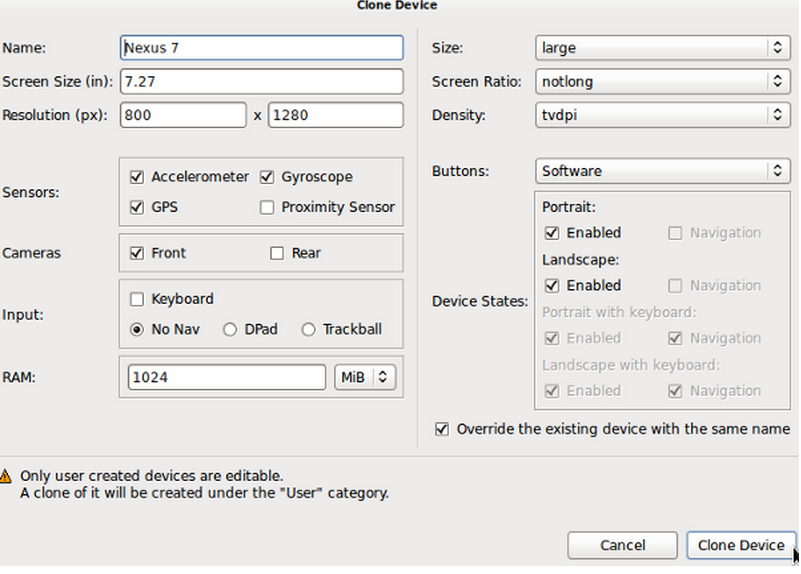

# Android SDK 上手指南：虚拟与物理设备

> 在本系列教程当中，我们共同学习如何开发 Android 应用程序。在之前的文章里，大家已经了解了 Android 项目当中的基本元素、接触了用户界面的设计以及数据存储方案。

在本系列教程当中，我们共同学习如何开发 Android 应用程序。在之前的文章里，大家已经了解了 Android 项目当中的基本元素、接触了用户界面的设计以及数据存储方案。接下来，我们将一同探索如何在物理及虚拟设备上运行自己的应用程序并与之互动。在系列文章的下一篇中，我们将分步讲解如何让应用程序运行在物理设备及模拟器当中。而在今天的教程里，我将带大家先来学习如何在 Eclipse 中设置物理与虚拟设备。

**介绍**

当大家开发将要公开发布的 Android 应用程序时，必须提前在物理实机与模拟器中对自己的产品进行测试。在模拟器方面，我们可以通过配置让虚拟设备拥有各种硬件及软件功能。虽然这样处理的效果不可能像真正在各种物理设备上那么可靠，但也足以帮助我们了解手头设备与外部可能接触的 Android 设备之间的差异。某些特定硬件与软件功能在模拟器中无法实现，但大家仍然可以在其中测试自己第一款应用程序中的大部分功能。

**1.硬件设备**

**第一步**

当大家开发 Android 应用程序时，应该首先关注成果在物理硬件设备上的运行情况。除了能够切实为我们带来应用程序外观、使用感受以及用户功能之外，硬件设备也是我们测试特定功能的惟一途径，例如通话。如果大家在开发过程中手边正好有一台硬件设备，也可以通过配置让模拟器拥有与其完全一致的硬件及软件功能，从而做到边开发边运行测试。

让我们首先将硬件设备与 Eclipse 相连。连接 Android 设备与计算机的就是大家都很熟悉的 USB 接口啦。我们可能需要在设备上启用 USB 调试，具体步骤为打开设备的设置屏幕、选择“开发者选项”、“等级设置”或者“应用程序”，然后选择“开发”。接着勾选 USB 调试项目。如果大家使用的设备上运行着 Android 4.2 或者更高版本，则可能需要通过设置让开发者选项正常显示。打开“关于手机”，然后在列表中重复多次（七次）点击“内部版本号”，最后返回之前的屏幕。

提示:大家可能还需要让自己的系统在 Android 设备接入时对其进行自动检测；没错，大多数情况下这一检测会默认进行，但我们还要需要防范万一。如果大家的 Windows 系统检测不到对应设备，请下载并安装 USB 驱动程序。如果大家使用的是 Linux 并在检测设备时遇到了麻烦，则可能需要使用 udev 文件并查看其中列出的设备制造商。如果仍然搞不定，请 点击此处 查看 Android 官方开发者指南中的对应说明。

**第二步**

一旦系统检测到了我们接入的 Android 设备，大家就可以在 Eclipse 中与其进行交互了。在下一篇教程中，我们将详细讲解如何处理这些工作，请大家安心期待。现在，我们只需要切换至 DDMS 视图。在 Eclipse 当中，选择“窗口”、“打开视图”然后选择“DDMS”。大家应该会在屏幕左侧的设备视图中看到自己接入的设备。另外，大家还会看到 LogCat 视图开始弹出消息，提示对该设备的处理正在进行。

接下来请大家花点时间，在设备视图中选定自己的设备后、认真通过文件浏览视图查看其中的内容。我们将看到设备上保存的各文件及文件夹。如大家所见，这些视图允许我们任意使用接入的设备，包括在上面运行、测试以及调试自己的应用程序。大家还可以使用设备视图中的各个按钮，其中包括截屏按钮——当万事就绪之后，各位可能希望截取几个精彩瞬间作为应用的介绍素材。

**2.虚拟设备**

**第一步**

现在让我们看看如何创建虚拟设备。在 Eclipse 中，选择“窗口”并点击“Android 虚拟设备管理器（简称 AVD 管理器）”以将其开启。AVD 管理器当中将显示两个选项卡，一个用于显示我们创建并启动的虚拟设备、另一个则用于管理可重新使用的设备定义。在未来的开发过程中，大家可能需要通过配置创建自己的 AVD，从而有针对性地对应用的某种功能加以测试；但作为初期学习，我们会发现直接使用现有设备定义显然更快也更方便。现在切换到“设备定义”选项卡当中。

大家会在 AVD 管理器当中看到一份设备定义清单，通过这种方式，我们可以保存设备配置、以备今后重复使用。大家也可以通过点击“新设备”按钮创建自己的设备定义。点击之后，我们会看到如下图所示的界面。

在这里，大家可以对虚拟设备的硬件和软件等进行全方位配置，其中包括屏幕尺寸、分辨率、传感器、摄像头、输入方式、像素密度以及按钮等。在创建了新设备之后，配置会显示在现有定义列表当中。大家应该尝试为自己配置的定义起个有意义的名称，这样我们才能更容易地在列表中将其找到。不过现在我们姑且使用已有定义来测试手中的应用，点击“取消”退出当前界面。

**第二步**

大家可以通过两种方式使用现有设备定义：直接复制当前设备定义并对属性进行修改，或者直接根据现有定义创建一个虚拟设备实例。在列表中选择一种设备并点击“克隆”。

克隆设备窗口中的各输入框将被自动填充为与所选定义匹配的内容。现有设备的配置与我们的要求基本一致，因此所有设备属性都可以保留下来，直接点击“克隆设备”即可。这样列表中就会出现一套设备定义副本。

如大家所见，我们可以一目了然地通过 Android 设备定义与用户设备定义的颜色区别来判断哪些是默认方案、哪些是定制方案。大家只能对用户定义进行编辑，因此在列表中选择刚刚创建好的克隆设备并点击“编辑”。

现在我们可以对设备的各项属性进行编辑了，完成后点击“编辑设备”以应用配置方案。现在大家可以根据列表中的设备定义创建 AVD 实例了。

**第三步**

只要根据现在设备定义创建 AVD 并将其运行在模拟器当中，大家就可以看到设备定义之一开始起效。从列表中选择一项设备定义并点击“创建 AVD”。在窗口中，我们可以对实例进行配置，或者直接保留定义中的所有设定。关于 AVD 选项列表的具体情况，大家可以 点击此处 查看 Android 开发者指南中的相关说明。现在点击“OK”以创建 AVD。

Eclipse 会切换回 Android 虚拟设备选项卡，这时我们的新设备就会显示在其中。在选定了新 AVD 之后，点击“开始”即可将其投入运行。

点击弹窗中的“启动”，Eclipse 将开始运行搭载着我们自定义 AVD 的模拟器。该设备可能需要几分钟才能完成启动，在设备已经开始运行后，大家就可以关闭 AVD 管理器了。

**第四步**

在适当条件下，模拟器会显示设备硬件所控制的虚拟版本。大家可以通过鼠标点击与其进行交互。除此之外，模拟器还支持多种键盘快捷键组合，习惯之后能大大简化我们的日常操作——例如设备上的“Home”键对应键盘上的“Home”键。大家可以 点击此处 查看 Android 开发者指南中所罗列的模拟器快捷键清单。

根据大家所创建的 AVD，我们可能需要按下 F2 或者点击“OK”来解除锁屏状态。如大家所见，模拟器会显示出如物理设备一样的效果。现在请大家花点时间探索一下虚拟设备，查看一下应用程序菜单、再启动几个应用试试。

正面启动虚拟设备中的浏览器应用。点击导航栏并输入要访问的网址。大家可以使用计算机键盘作为输入设备。模拟器会自动使用任何计算机上可用的互联网连接，这样我们就可以在测试应用程序时评估其 Web 连接功能。

**第五步**

现在请保持 AVD 的运行状态，切换回 Eclipse 并再次打开 DDMS 视图。大家将在设备视图当中看到自己的虚拟设备已经出现在列表内，它旁边还会显示已经接入的物理设备。Eclipse 将显示一份当前设备上运行着的所有进程的清单。选中某个进程后，我们就可以利用设备视图中的多个功能按钮对其进行处理。现在请大家花点时间认真观察这一界面，它们将在未来成为我们调试应用的好帮手。

**总结**

现在我们已经熟悉了在 Eclipse 中使用硬件或者模拟设备的整个流程。在下一篇教程中，我们将正式开始让应用程序运行在来自 Eclipse 的设备当中。在后续文章中，我们还会探讨 Android 通用组件与 Activity 周期，帮助大家明确未来学习的方向。在大家开发了几款应用程序之后，也可能会愿意回头再交温习本系列教程。希望这几篇文章能成为朋友们在应用程序创建及设备交互过程中的指引与参考。

原文链接：

http://mobile.tutsplus.com/tutorials/android/android-sdk-virtual-physical-devices/